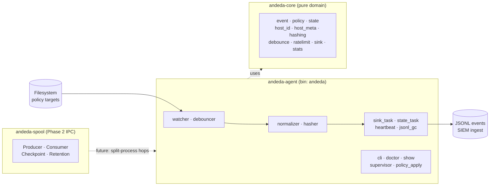

# ANDEDA

ANDEDA is an AI-Native Detection Engine for Device Assurance.

The current release focuses on a local filesystem monitoring agent that emits
JSONL posture events for SIEM ingestion on macOS and Windows. It is intended as
a practical foundation for detecting changes to sensitive files, policy targets,
and device assurance signals.

## Architecture

ANDEDA is a Rust workspace with three crates:

- `andeda-core` — pure domain library (event, policy, state, hashing, …). No OS,
  `tokio`, or filesystem-watcher dependencies, so it stays reusable across
  processes and unit tests.
- `andeda-agent` — the `andeda` daemon binary. Hosts the `tokio` runtime, the
  `notify`-based filesystem watcher, the event pipeline, CLI commands, and
  platform glue. Depends on `andeda-core`.
- `andeda-spool` — Phase 2 JSONL=IPC primitive (`Producer` / `Consumer` /
  `Checkpoint` / `Retention`) used at every cross-process hop. Domain-neutral
  and independent of the other two crates.



## Features

- Filesystem watcher for configured policy targets.
- JSONL event output suitable for SIEM or log pipeline ingestion.
- Built-in policy defaults for macOS and Windows.
- User override policy support through YAML configuration.
- Event normalization, debouncing, rate limiting, and spool handling.
- Host metadata, state tracking, and crash recovery support.
- Diagnostic commands for configuration, paths, and runtime state.

## Installation

Install the Rust toolchain listed in `rust-toolchain.toml`, then build the
workspace:

```sh
cargo build --release
```

The `andeda` binary is produced at:

```sh
target/release/andeda
```

For development builds, run:

```sh
cargo build
```

## Usage

Run the agent:

```sh
cargo run -p andeda-agent -- run
```

Inspect the effective configuration:

```sh
cargo run -p andeda-agent -- show config
```

Inspect expanded watch paths:

```sh
cargo run -p andeda-agent -- show paths
```

Run diagnostics without starting the daemon:

```sh
cargo run -p andeda-agent -- doctor
```

Print version information:

```sh
cargo run -p andeda-agent -- version
```

## Configuration

ANDEDA uses built-in defaults plus an optional YAML policy file.

Example policy:

```yaml
version: 1
host_id_strategy: machine_id

overrides:
  - id: shadow-ai-binaries-macos
    tier: standard

targets:
  - id: team-mcp-allowlist
    description: Example MCP allowlist file
    tier: critical
    platform: any
    paths:
      - "~/.config/example/mcp-allowlist.json"
    recursive: false
    follow_symlinks: false
```

An example policy file is available at `config/policy.example.yaml`.

You can override runtime paths from the command line:

```sh
cargo run -p andeda-agent -- \
  --policy config/policy.example.yaml \
  --state-db ./state.db \
  --events-dir ./events \
  run
```

Default production policy locations are platform-specific. The example policy
can be adapted for `/etc/andeda/policy.yaml` on Unix-like systems or
`%ProgramData%\Andeda\policy.yaml` on Windows.

## License

This project is licensed under the Apache License 2.0.

You may use this software for personal, internal, and commercial purposes,
subject to the terms of the Apache License 2.0.

See [LICENSE](LICENSE) and [NOTICE](NOTICE) for details.

## Disclaimer

This software is provided "as is", without warranties or guarantees of any kind.

The author does not guarantee correctness, availability, reliability, security,
compatibility, or fitness for any particular purpose.

The author is not responsible for any direct, indirect, incidental,
consequential, special, exemplary, or other damages, including but not limited to
outages, data loss, security incidents, business interruption, incorrect
results, compatibility problems, or other problems arising from the use of this
software.

Use this software at your own risk.

## Commercial Support and Future Offerings

Commercial support, hosted services, enterprise features, paid add-ons,
consulting, or professional services may be offered separately in the future.

Some future commercial features, hosted components, enterprise modules, or
binary-only add-ons may be distributed under separate commercial terms.

The open-source version remains available under the Apache License 2.0.
