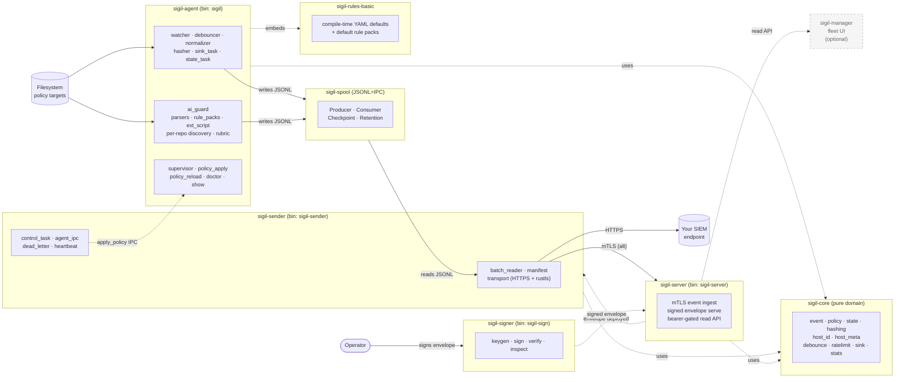

# Sigil

> AI Security Posture Management (AI-SPM) for developer machines.
> Sigil watches AI coding agent guard surfaces — hooks, permissions,
> sandbox boundaries — scores their risk, and feeds hash-anchored
> events to your SIEM.


## The problem

Claude Code, Codex, Gemini CLI, Cursor — each AI coding agent ships its own
guard surface (`hooks`, `permissions`, `[sandbox]`, MCP allowlists) across
user-global, per-project, and per-session scopes. The autonomy ratchet keeps
moving: hooks run in the host shell, matchers can be `.*`, and a `PreToolUse`
hook containing `rm -rf` is treated by these tools the same as one that just
logs. Security teams have no fleet view, no drift alert, no risk index.

## What Sigil does

**Sigil measures. It does not block.** It watches the guard surfaces of every
supported AI agent, scores their risk against a transparent rubric (sandbox
boundary × hook content × matcher scope × source provenance), and emits the
score plus the underlying reasons as a hash-anchored JSONL event your SIEM
can ingest. Enforcement stays where it belongs — in your MDM, your EDR, or
your operator's hands. Sigil's job is to make sure those decisions are
informed.

Underneath the AI-SPM layer is a generic file-posture sensor: a small Rust
agent that watches policy-defined files on macOS, Windows, and Linux, hashes
every change with blake3, and ships the events through a signed-policy
pipeline (mTLS, ed25519). The risk scoring is layered on top — it parses AI
agent config files, applies the rubric, and emits richer evidence variants
alongside the raw `file_change` events.

Each event is one JSON object on its own line:

```json
{
  "schema_version": 1,
  "event_id": "019e0cea-42f1-7ef3-9a6a-1721e98ee2ba",
  "ts": "2026-05-10T07:14:32.512Z",
  "host_id": "a2e1f4c9b8d7",
  "agent_version": "0.1.0",
  "severity": "warn",
  "source": {"kind": "file_system"},
  "subject": {"kind": "path", "value": "/Users/alice/.cursor/mcp.json"},
  "evidence": {
    "kind": "file_change",
    "change_kind": "modified",
    "before_hash": "blake3:a31f1c7e9d8b…",
    "after_hash":  "blake3:0d72f8a4c6e8…",
    "size_after": 2148,
    "evidence_quality": "definitive"
  },
  "target_id": "team-mcp-allowlist"
}
```

And — shipped in Phase 3b.1 (Claude Code + Codex; Gemini + Cursor coming
in 3b.2) — a richer evidence variant for AI guard surfaces:

```json
{
  "evidence": {
    "kind": "ai_guard_risk_assessed",
    "tool": "claude_code",
    "scope": {"kind": "user_global"},
    "score": 7.5,
    "bucket": "critical",
    "reasons": [
      {"kind": "destructive_in_inline_command", "pattern": "rm -rf",
       "hook_event": "PreToolUse", "snippet": "..."},
      {"kind": "no_sandbox", "executor": "host_shell"},
      {"kind": "broad_matcher", "hook_event": "PreToolUse", "matcher": ".*"}
    ],
    "is_reattestation": false
  }
}
```

## Why Sigil?

- **Measures, doesn't block.** AI guard surfaces are scored, not enforced.
  Enforcement is left to MDM/EDR; Sigil's job is to make sure those decisions
  are informed.
- **Tiny, honest, host-only.** Pure user-space. No kernel module, no eBPF, no
  phone-home. A single binary plus a YAML policy file.
- **Hash-anchored events.** Every observation carries blake3 hashes (before /
  after) and an `evidence_quality` marker, so a SIEM can tell a clean
  observation apart from one that was coalesced or delayed.
- **Versioned schema.** `schema_version` is part of the contract; rename = break.
- **AI-aware defaults.** Built-in policies cover the paths AI coding agents
  actually touch on macOS, Windows, and Linux — including Claude Code, Codex,
  Gemini CLI, and Cursor guard files.

### What it monitors

Out of the box, with built-in defaults plus your policy YAML:

- **AI agent guard surfaces** — Claude Code (`~/.claude/settings*.json`,
  `<repo>/.claude/`), Codex (`~/.codex/config.toml`, `<repo>/.codex/`),
  **Claude Desktop** (`~/Library/Application Support/Claude/claude_desktop_config.json`
  on macOS, `%APPDATA%\Claude\…` on Windows, `~/.config/Claude/…` on Linux),
  **Continue.dev** (`~/.continue/config.json`), `~/.gemini/` and
  `<repo>/.gemini/`, `~/.cursor/mcp.json`. Hash-anchored events on every
  change; risk score on the contents (Claude Code + Codex shipped 3b.1;
  Claude Desktop + Continue shipped 3b.6; Gemini + Cursor parsers planned
  in 3b.2).
- **Hook scripts** — convention dirs (`~/.claude/hooks/**`,
  `<repo>/.claude/hooks/**`) watched recursively, so a hook script silently
  going from "deny" to "exit 0" is visible.
- **MCP & launch surfaces** — `~/.cursor/mcp.json`, new `.plist` in
  `~/Library/LaunchAgents/`, etc.
- **Credential & shell startup** — `~/.aws/credentials`, `~/.ssh/`,
  `.zshrc`, `.bashrc`, `.profile`.
- **Anything you list** under `targets:` in your policy YAML.

## Architecture

Sigil is a Rust workspace with seven crates: three long-running binaries,
one operator CLI, and three shared libraries.

**Long-running binaries**

- `sigil-agent` — the host daemon (`sigil` binary). Owns the `tokio`
  runtime, the `notify`-based filesystem watcher, the event pipeline, CLI
  commands, and platform glue. Writes JSONL posture events to the local
  spool.
- `sigil-sender` — the uploader (`sigil-sender` binary). Reads JSONL
  batches from the spool, ships them to a SIEM endpoint over HTTPS
  (rustls), and hands signed policy responses back to the agent over IPC.
- `sigil-server` — OSS reference receiver (`sigil-server` binary). Accepts
  events from `sigil-sender` over mTLS, persists JSONL, and serves
  ed25519-signed policy envelopes back to clients. The simplest possible
  SIEM-shaped endpoint operators can stand up for an end-to-end test or as
  the upstream for [`sigil-manager`](https://github.com/Ju571nK/sigil-manager).

**Operator CLI**

- `sigil-signer` — keystore + envelope tool (`sigil-sign` binary).
  `keygen` / `sign` / `verify` / `inspect` for the ed25519 keys that
  authenticate signed policy responses. One-shot — not a daemon.

**Libraries**

- `sigil-core` — pure domain library (event, policy, state, hashing, …).
  No OS, `tokio`, or filesystem-watcher dependencies. Consumed by every
  binary.
- `sigil-spool` — JSONL=IPC primitive (`Producer` / `Consumer` /
  `Checkpoint` / `Retention`) used at the agent → sender hop. Durable,
  crash-recoverable, domain-neutral.
- `sigil-rules-basic` — compile-time-embedded baseline rulesets (macOS,
  Linux, and Windows defaults). The OSS fallback when no operator policy
  is supplied; extended rule packs ship separately.



## Status

- **0.1.x — alpha.** The event schema and CLI surface can break between minor
  releases until 0.2. `schema_version` in every event lets downstream
  consumers detect this.
- **Platforms.** macOS, Windows, and Linux at runtime. The Linux runtime
  landed as a minimal foundation (Phase 3a) and is exercised in CI; some
  refinements are marked `TODO(community)` in `platform/linux.rs` — see
  [CONTRIBUTING.md](CONTRIBUTING.md).
- **Schema.** Version `1`.

## Roadmap

- **Phase 1 — shipped.** Filesystem watcher, JSONL sink, host metadata, state
  database, debounce / rate-limit, JSONL retention GC.
- **Phase 2 — shipped.** Split-process IPC via the durable spool, signed
  policy envelopes, a sender that ships JSONL over mTLS, an operator signing
  CLI, and an OSS reference server. Transport spec was locked on 2026-05-10.
- **Phase 3a — shipped.** Linux runtime (inotify watcher, `/etc/passwd` user
  enumeration, hardware fingerprint). Minimal foundation; refinements open
  for community contribution.
- **Phase 3b.1 — shipped.** AI Agent Risk Index foundation: scoring rubric
  for **Claude Code + Codex** hooks, permissions, sandbox boundaries, and
  MCP servers. Emits `ai_guard_risk_assessed` evidence variants alongside
  the underlying `file_change` events; `sigil show risk` operator CLI.
- **Phase 3b.3 — shipped 053bbe3.** Dynamic hook-script watch:
  external (non-convention-dir) hook scripts referenced by claude_code /
  codex / continue_dev configs are now read + scanned for destructive
  patterns (256 KB cap, binary detection, follow symlinks via dunce).
  Synthetic in-memory WatchTargets make fsnotify fire on script changes
  between policy reloads; reconcile_ext_scripts diffs the registry on
  reload. Wire-additive — no new AiGuardReason variants. Also closes a
  pre-existing gap where codex convention-dir scripts were never read.
- **Phase 3b.4 — shipped.** Server-side fleet aggregation on
  `sigil-server`: bearer-gated read API (9 endpoints — `/v1/healthz`,
  `/v1/meta`, `/v1/policy/meta`, `/v1/fleet/hosts` + detail, `/v1/fleet/risk`,
  `/v1/fleet/compliance`, `/v1/events` + lookup). In-memory per-host
  index rebuilt from JSONL on boot, updated inline on each `POST /v1/events`.
- **Phase 3b.5 — planned.** `sigil doctor` integration + operator-tunable
  rubric (policy.yaml `risk_rubric` section).
- **Phase 3b.6 — shipped.** Application-form coverage: Claude Desktop
  (Anthropic.app) + Continue.dev (VSCode/JetBrains 확장) parsers.
  Reuses Phase 3b.1 rubric — MCP server entries, slashCommands /
  customCommands inline destructive patterns, external script
  references. Emits `ai_guard_risk_assessed` with new
  `scope.kind = "application"`.
- **Phase 3b.6.1 — shipped.** Continue.dev per-repo config auto-discovery.
  Operator lists workspace roots in the signed policy envelope
  (`continue_workspaces: [path, ...]`); agent walks each root 1-level
  deep, spawns a `ContinueDevProjectParser` for every direct subdir
  that contains `.continue/config.json`, and emits
  `ai_guard_risk_assessed` events with `scope = project{path: <repo>}`.
  Hot-reload via the existing signed policy reload path.
- **Phase 3b.6.2 — shipped.** Per-repo auto-discovery extended to
  Claude Code (`<repo>/.claude/settings*.json` + `.claude/hooks/`)
  and Codex (`<repo>/.codex/config.toml`). Same operator UX as
  3b.6.1 — `claude_code_workspaces: [path, ...]` and
  `codex_workspaces: [path, ...]` in the signed policy envelope.
  Discovery logic generalized into a shared
  `workspace_discovery::discover_per_repo` helper.
- **Phase 3b.7 — shipped.** Declarative rule pack architecture (MVP).
  New `rule_packs:` field in the signed policy envelope lets operators
  declare scan rules without recompiling sigil-agent. Tier 1 DSL: file
  path + JSON/TOML selector + matcher → `AiGuardReason` emit. OSS
  defaults shipped for **Gemini CLI** (`~/.gemini/settings.json`) and
  **Cursor** (`~/.cursor/mcp.json`) — replaces the originally-planned
  hardcoded Phase 3b.2.
- **Phase 3c — planned.** Reproducible-build attestation; additional
  posture signals.

## Ecosystem

The agent in this repo is the OSS core. A separate, companion project extends
it with a fleet view:

- **[`sigil-manager`](https://github.com/Ju571nK/sigil-manager)** —
  self-hostable web console for fleet visibility. Reads from `sigil-server`
  and renders dashboards (AI Guard risk by host, events over time, policy
  compliance per host). Public repo, developed separately from this one;
  early stages.

The OSS agent works standalone — point `sigil-sender` at any SIEM endpoint and
you're done. `sigil-manager` is an additive convenience layer for teams that
want a built-in dashboard rather than rolling their own queries in their SIEM,
not a requirement.

## Design principles

- **No kernel module, no eBPF.** OS-provided file-event APIs only.
- **`forbid(unsafe_code)`** in the core domain crate.
- **Reproducible release builds.** `lto = "thin"`, `codegen-units = 1`,
  `strip = "symbols"`, `panic = "unwind"`.
- **Host-only telemetry.** The agent never opens an outbound connection on
  its own. Shipping events anywhere is a separate, explicit component.
- **The event schema is a public contract.** Wire-string renames and field
  removals are breaking changes and bump the major version.

## Installation

Install the Rust toolchain listed in `rust-toolchain.toml`, then build the
workspace:

```sh
cargo build --release
```

The agent binary is produced at:

```sh
target/release/sigil
```

For development builds, run:

```sh
cargo build
```

### Linux packages (`.deb` / `.rpm`)

All four binaries (agent, sender, server, signer) are packaged for
Debian/Ubuntu and RHEL/Rocky/Fedora. Daemons install a (disabled-by-default)
systemd unit + `/etc/sigil/<binary>.yaml.example`; `sigil-signer` is an
operator CLI so it ships just the `/usr/bin/sigil-sign` binary.

```sh
cargo install cargo-deb cargo-generate-rpm   # one-time
packaging/build.sh                            # all 4 packages, both formats
packaging/build.sh sender rpm                 # or: just one package, one format

# Agent (host daemon).
sudo dnf install ./target/generate-rpm/sigil-0.1.0-1.x86_64.rpm
sudo systemctl enable --now sigil

# Sender (uploads spool to a sigil-server over mTLS).
sudo dnf install ./target/generate-rpm/sigil-sender-0.1.0-1.x86_64.rpm
sudo cp /etc/sigil/sender.yaml.example /etc/sigil/sender.yaml && sudo $EDITOR /etc/sigil/sender.yaml
sudo systemctl enable --now sigil-sender

# Server (OSS reference: receives events, serves signed policy).
sudo dnf install ./target/generate-rpm/sigil-server-0.1.0-1.x86_64.rpm
sudo cp /etc/sigil/server.yaml.example /etc/sigil/server.yaml && sudo $EDITOR /etc/sigil/server.yaml
sudo systemctl enable --now sigil-server

# Signer (operator CLI: keygen / sign / verify / inspect).
sudo dnf install ./target/generate-rpm/sigil-signer-0.1.0-1.x86_64.rpm
sigil-sign --help
```

See [`packaging/README.md`](packaging/README.md) for details.

## Usage

Run the agent:

```sh
cargo run -p sigil-agent -- run
```

Inspect the effective configuration:

```sh
cargo run -p sigil-agent -- show config
```

Inspect expanded watch paths:

```sh
cargo run -p sigil-agent -- show paths
```

Run diagnostics without starting the daemon:

```sh
cargo run -p sigil-agent -- doctor
```

Print version information:

```sh
cargo run -p sigil-agent -- version
```

## Configuration

Sigil uses built-in defaults plus an optional YAML policy file.

Example policy:

```yaml
version: 1
host_id_strategy: machine_id

overrides:
  - id: shadow-ai-binaries-macos
    tier: standard

targets:
  - id: team-mcp-allowlist
    description: Example MCP allowlist file
    tier: critical
    platform: any
    paths:
      - "~/.config/example/mcp-allowlist.json"
    recursive: false
    follow_symlinks: false
```

An example policy file is available at `config/policy.example.yaml`.

You can override runtime paths from the command line:

```sh
cargo run -p sigil-agent -- \
  --policy config/policy.example.yaml \
  --state-db ./state.db \
  --events-dir ./events \
  run
```

Default production policy locations are platform-specific. The example policy
can be adapted for `/etc/sigil/policy.yaml` on Unix-like systems or
`%ProgramData%\Sigil\policy.yaml` on Windows.

## Security

For responsible disclosure of vulnerabilities, see [SECURITY.md](SECURITY.md).

## Contributing

Bug reports, policy suggestions, and patches are welcome. See
[CONTRIBUTING.md](CONTRIBUTING.md) before opening a PR.

## License

This project is licensed under the Apache License 2.0.

You may use this software for personal, internal, and commercial purposes,
subject to the terms of the Apache License 2.0.

See [LICENSE](LICENSE) and [NOTICE](NOTICE) for details.

## Disclaimer

This software is provided "as is", without warranties or guarantees of any kind.

The author does not guarantee correctness, availability, reliability, security,
compatibility, or fitness for any particular purpose.

The author is not responsible for any direct, indirect, incidental,
consequential, special, exemplary, or other damages, including but not limited to
outages, data loss, security incidents, business interruption, incorrect
results, compatibility problems, or other problems arising from the use of this
software.

Use this software at your own risk.

## Commercial Support and Future Offerings

Commercial support, hosted services, enterprise features, paid add-ons,
consulting, or professional services may be offered separately in the future.

Some future commercial features, hosted components, enterprise modules, or
binary-only add-ons may be distributed under separate commercial terms.

The open-source version remains available under the Apache License 2.0.
