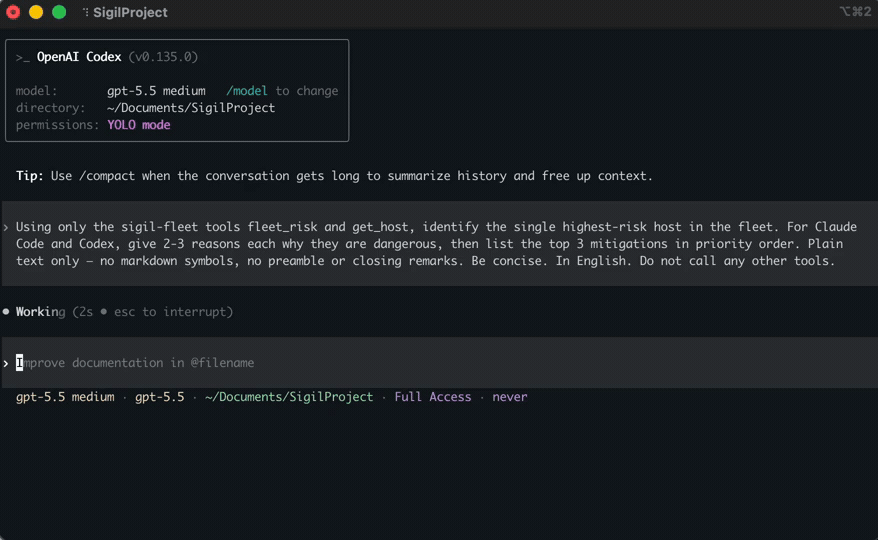
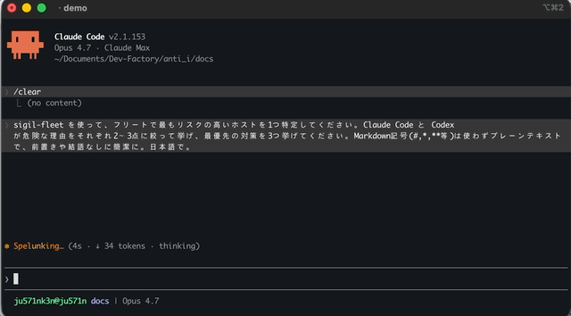
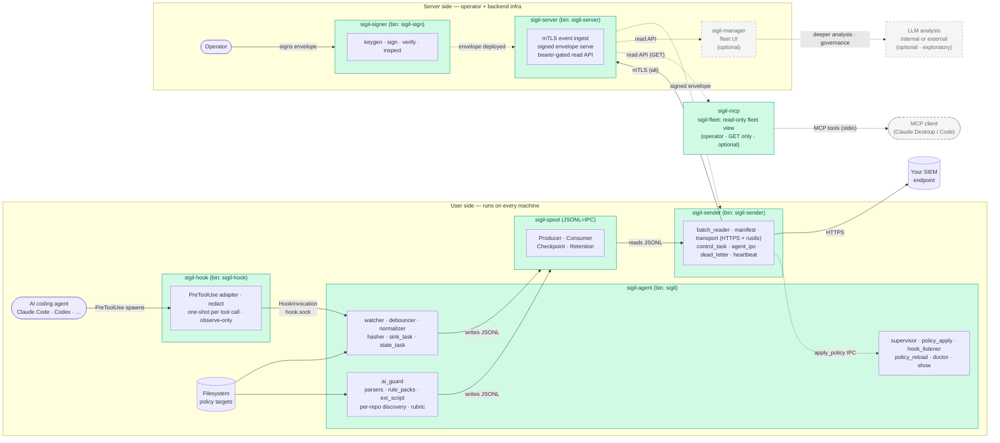

# Sigil — fleet AI security posture management for AI coding agents

> Sigil gives security teams a **fleet-wide view of what their AI coding agents
> are allowed to do.** A lightweight **client agent** on every developer machine
> scores the guard surfaces of Claude Code, Cursor, Codex, and Gemini CLI —
> permissions, hooks, sandbox boundaries, and `mcp.json` servers — and ships
> **hash-anchored events** over mTLS to a central **`sigil-server`**, which feeds
> your **SIEM** and the optional **`sigil-manager`** fleet dashboard and pushes
> **signed policy** back down. It **measures** posture across the fleet; it does
> not block. Host-side **AI Security Posture Management (AI-SPM)**, in Rust.


**EDR sees the command that ran. Sigil sees the permission that let it run** —
the config that decided what your AI coding agent was allowed to do in the
first place. Sigil measures that surface; it does not block.

## See it

A security team's view first: **`sigil-manager`** renders the fleet's posture as
a triage console — every AI Guard risk event across every host and agent, with
severity, status, and assignee, the way a SOC already works. (The dashboard is a
separate project: [`sigil-manager`](https://github.com/Ju571nK/sigil-manager).)


Underneath that dashboard the same posture is **queryable** over plain MCP, in
two read-only surfaces: **`sigil-check`** on a developer's own machine (this host
only — the default an AI coding agent registers), and **`sigil-fleet`** for
operators, exposing the whole fleet through `sigil-server`. The demo below is the
operator `sigil-fleet` view: a real Codex (`gpt-5.5`) session asks it to find the
riskiest host in the fleet and explain it — no config is touched, the model just
*reads* posture and reasons over it:



The agent calls Sigil's MCP server (here registered as `sigil-fleet`), gets back
`dev-mbp-01` at **critical / 10.0**, and the reasons are concrete: `no_sandbox`
on a host shell, a `.*` `PreToolUse` matcher that allows `Bash`, an external
`rm -rf` hook, and a remote MCP server — for both Claude Code and Codex.

And it isn't Codex-specific. Here's the **same fleet** read from **Claude Code**
(Opus 4.7) instead — same tools, same posture (its prompt and answer happen to
be in Japanese; the tool calls and scoring are in English):



Same posture, different agent — because Sigil exposes it as plain MCP, not a
vendor-specific plugin.

Want the raw tool output behind that? It's produced by
[`docs/sigil-mcp-demo.sh`](docs/sigil-mcp-demo.sh) (every number is a real tool
response, not mocked):


`fleet_risk` ranks hosts, `get_host` breaks one host's score down per agent
(`claude_code` 10.0, `codex` 9.50, the rest `low`) and lists exactly why. That's
nine read-only GET tools in total — no write or remediation path, by construction.

To watch the underlying file-posture scoring happen locally — a clean repo config
scoring **0 / low** until a `.*` `PreToolUse` hook running `rm -rf $HOME` lands
and Sigil re-scores that project **7.5 / critical**
(`destructive_in_inline_command`, `no_sandbox`, `broad_matcher`) — run
[`docs/aiguard-demo.sh`](docs/aiguard-demo.sh) from the repo root (fully
sandboxed; it never touches your real `~/.claude`).

## Why now

Through 2025–2026, the AI coding agent's *configuration* became the attack
surface. **[TrustFall](https://www.theregister.com/security/2026/05/07/claude-code-trust-prompt-can-trigger-one-click-rce/5235319)**
(May 2026; [research](https://adversa.ai/blog/trustfall-coding-agent-security-flaw-rce-claude-cursor-gemini-cli-copilot/))
showed that a cloned repo shipping a `.claude/settings.json`
(`enableAllProjectMcpServers`) plus a `.mcp.json` auto-approves an unsandboxed
MCP server — one "trust this folder" click is full RCE, across Claude Code,
Cursor, Gemini CLI, and Copilot. A year earlier,
**[AWS Kiro](https://aws.amazon.com/security/security-bulletins/AWS-2025-019/)**
([writeup](https://embracethered.com/blog/posts/2025/aws-kiro-aribtrary-command-execution-with-indirect-prompt-injection/))
could be steered by indirect prompt injection into rewriting its *own*
`.vscode/settings.json` (`"kiroAgent.trustedCommands": ["*"]`) and MCP config to
run arbitrary commands. Same root in both: the files that decide what an agent
may do — `settings.json`, `.mcp.json`, command allowlists, sandbox flags.

That surface is exactly what Sigil watches. It can't stop the prompt injection,
and doesn't try to — it **measures**: it scores those configs (no sandbox, broad
matcher, auto-approved MCP, destructive hook) and emits a hash-anchored event
the moment one changes, so a dangerous config — whether a cloned repo dropped it
or an agent rewrote its own — reaches your SIEM instead of staying silent.

## The problem

Claude Code, Codex, Gemini CLI, Cursor — each AI coding agent ships its own
guard surface (`hooks`, `permissions`, `[sandbox]`, MCP allowlists) across
user-global, per-project, and per-session scopes. The autonomy ratchet keeps
moving: hooks run in the host shell, matchers can be `.*`, and a `PreToolUse`
hook containing `rm -rf` is treated by these tools the same as one that just
logs. Security teams have no fleet view, no drift alert, no risk index.

## What Sigil does

**Sigil measures. It does not block.** It watches the guard surfaces of every
supported AI agent, scores their risk against a transparent rubric (sandbox
boundary × hook content × matcher scope × source provenance), and emits the
score plus the underlying reasons as a hash-anchored JSONL event your SIEM
can ingest. Enforcement stays where it belongs — in your MDM, your EDR, or
your operator's hands. Sigil's job is to make sure those decisions are
informed.

Underneath the AI-SPM layer is a generic file-posture sensor: a small Rust
agent that watches policy-defined files on macOS, Windows, and Linux, hashes
every change with blake3, and ships the events through a signed-policy
pipeline (mTLS, ed25519). The risk scoring is layered on top — it parses AI
agent config files, applies the rubric, and emits richer evidence variants
alongside the raw `file_change` events.

Each event is one JSON object on its own line:

```json
{
  "schema_version": 1,
  "event_id": "019e0cea-42f1-7ef3-9a6a-1721e98ee2ba",
  "ts": "2026-05-10T07:14:32.512Z",
  "host_id": "a2e1f4c9b8d7",
  "agent_version": "0.1.0",
  "severity": "warn",
  "source": {"kind": "file_system"},
  "subject": {"kind": "path", "value": "/Users/alice/.cursor/mcp.json"},
  "evidence": {
    "kind": "file_change",
    "change_kind": "modified",
    "before_hash": "blake3:a31f1c7e9d8b…",
    "after_hash":  "blake3:0d72f8a4c6e8…",
    "size_after": 2148,
    "evidence_quality": "definitive"
  },
  "target_id": "team-mcp-allowlist"
}
```

And — shipped in Phase 3b.1 (Claude Code + Codex; Gemini + Cursor coming
in 3b.2) — a richer evidence variant for AI guard surfaces:

```json
{
  "evidence": {
    "kind": "ai_guard_risk_assessed",
    "tool": "claude_code",
    "scope": {"kind": "user_global"},
    "score": 7.5,
    "bucket": "critical",
    "reasons": [
      {"kind": "destructive_in_inline_command", "pattern": "rm -rf",
       "hook_event": "PreToolUse", "snippet": "..."},
      {"kind": "no_sandbox", "executor": "host_shell"},
      {"kind": "broad_matcher", "hook_event": "PreToolUse", "matcher": ".*"}
    ],
    "is_reattestation": false
  }
}
```

## Why Sigil?

- **Measures, doesn't block.** AI guard surfaces are scored, not enforced.
  Enforcement is left to MDM/EDR; Sigil's job is to make sure those decisions
  are informed.
- **Tiny, honest, host-only.** Pure user-space. No kernel module, no eBPF, no
  phone-home. A single binary plus a YAML policy file.
- **Hash-anchored events.** Every observation carries blake3 hashes (before /
  after) and an `evidence_quality` marker, so a SIEM can tell a clean
  observation apart from one that was coalesced or delayed.
- **Versioned schema.** `schema_version` is part of the contract; rename = break.
- **AI-aware defaults.** Built-in policies cover the paths AI coding agents
  actually touch on macOS, Windows, and Linux — including Claude Code, Codex,
  Gemini CLI, and Cursor guard files.

### What it monitors

Out of the box, with built-in defaults plus your policy YAML:

- **AI agent guard surfaces** — Claude Code (`~/.claude/settings*.json`,
  `<repo>/.claude/`), Codex (`~/.codex/config.toml`, `<repo>/.codex/`),
  **Claude Desktop** (`~/Library/Application Support/Claude/claude_desktop_config.json`
  on macOS, `%APPDATA%\Claude\…` on Windows, `~/.config/Claude/…` on Linux),
  **Continue.dev** (`~/.continue/config.json`), `~/.gemini/` and
  `<repo>/.gemini/`, `~/.cursor/mcp.json`. Hash-anchored events on every
  change; risk score on the contents (Claude Code + Codex shipped 3b.1;
  Claude Desktop + Continue shipped 3b.6; Gemini + Cursor parsers shipped 3b.8).
- **Hook scripts** — convention dirs (`~/.claude/hooks/**`,
  `<repo>/.claude/hooks/**`) watched recursively, so a hook script silently
  going from "deny" to "exit 0" is visible.
- **MCP & launch surfaces** — `~/.cursor/mcp.json`, new `.plist` in
  `~/Library/LaunchAgents/`, etc.
- **Credential & shell startup** — `~/.aws/credentials`, `~/.ssh/`,
  `.zshrc`, `.bashrc`, `.profile`.
- **Anything you list** under `targets:` in your policy YAML.

## Architecture

Sigil is a Rust workspace with nine crates: three long-running binaries,
one operator CLI, one read-only MCP server, one runtime hook, and three
shared libraries.

**Long-running binaries**

- `sigil-agent` — the host daemon (`sigil` binary). Owns the `tokio`
  runtime, the `notify`-based filesystem watcher, the event pipeline, CLI
  commands, and platform glue. Writes JSONL posture events to the local
  spool.
- `sigil-sender` — the uploader (`sigil-sender` binary). Reads JSONL
  batches from the spool, ships them to a SIEM endpoint over HTTPS
  (rustls), and hands signed policy responses back to the agent over IPC.
- `sigil-server` — OSS reference receiver (`sigil-server` binary). Accepts
  events from `sigil-sender` over mTLS, persists JSONL, and serves
  ed25519-signed policy envelopes back to clients. The simplest possible
  SIEM-shaped endpoint operators can stand up for an end-to-end test or as
  the upstream for [`sigil-manager`](https://github.com/Ju571nK/sigil-manager).

**Operator CLI**

- `sigil-signer` — keystore + envelope tool (`sigil-sign` binary).
  `keygen` / `sign` / `verify` / `inspect` for the ed25519 keys that
  authenticate signed policy responses. One-shot — not a daemon.

**MCP server**

- `sigil-mcp` — read-only MCP server (`sigil-mcp` binary), two auto-detected
  modes that register under distinct names. **`sigil-check`** (default, no server
  URL) reads the local `sigil-agent` control socket to surface *only this
  machine's* AI Guard posture — no server, no fleet; this is what an AI coding
  agent (Claude Desktop/Code, Codex) registers. **`sigil-fleet`** (operators)
  exposes a `sigil-server`'s bearer-gated read API as Model Context Protocol
  tools for fleet-wide posture, run beside `sigil-server` / `sigil-manager`.
  Read-only by construction: no write or remediation tools.
  See [`crates/sigil-mcp/README.md`](crates/sigil-mcp/README.md).

**Runtime hook**

- `sigil-hook` — runtime observer at the AI agent **tool boundary**
  (`sigil-hook` binary). A short-lived process the agent spawns per tool call
  (Claude Code `PreToolUse` first; the per-agent adapter shape generalizes to
  Codex/Gemini/Cursor). It normalizes and redacts the call (blake3 hash over
  the raw text + masked preview) and emits one event to `sigil-agent` over a
  dedicated `hook.sock`, reusing the spool → sender pipeline. **Observe-only**
  — never denies, always exits 0, latency-bounded; the agent stamps the kernel
  peer-uid for attribution. The *runtime* companion to AI Guard's *static*
  config scoring (#64, Stage 1).

**Libraries**

- `sigil-core` — pure domain library (event, policy, state, hashing, …).
  No OS, `tokio`, or filesystem-watcher dependencies. Consumed by every
  binary.
- `sigil-spool` — JSONL=IPC primitive (`Producer` / `Consumer` /
  `Checkpoint` / `Retention`) used at the agent → sender hop. Durable,
  crash-recoverable, domain-neutral.
- `sigil-rules-basic` — compile-time-embedded baseline rulesets (macOS,
  Linux, and Windows defaults). The OSS fallback when no operator policy
  is supplied; extended rule packs ship separately.

The diagram below is a **runtime view** — where each component runs and how data
and signed policy flow between machines. The pure libraries (`sigil-core`,
`sigil-rules-basic`) compile into the binaries above, so they aren't drawn as
separate boxes.



## Status

- **0.1.x — alpha.** The event schema and CLI surface can break between minor
  releases until 0.2. `schema_version` in every event lets downstream
  consumers detect this.
- **Platforms.** macOS, Windows, and Linux at runtime. The Linux runtime
  landed as a minimal foundation (Phase 3a) and is exercised in CI; some
  refinements are marked `TODO(community)` in `platform/linux.rs` — see
  [CONTRIBUTING.md](CONTRIBUTING.md).
- **Schema.** Version `1`.

## Roadmap

**Shipped:** filesystem posture sensor with hash-anchored JSONL events
(Phase 1) · split-process, signed-policy pipeline over mTLS with an OSS
reference server (Phase 2) · Linux runtime (Phase 3a) · the **AI Agent Risk
Index** — a transparent scoring rubric for Claude Code, Codex, Claude Desktop,
Continue.dev, Gemini CLI, and Cursor guard surfaces (Phase 3b) · declarative
rule packs operators ship without recompiling · license-enforcement structure
(measures, doesn't block).

**Planned:** reproducible-build attestation, additional posture signals.

See **[ROADMAP.md](ROADMAP.md)** for the full phase-by-phase log with merge SHAs.

## Ecosystem

The agent in this repo is the OSS core. A separate, companion project extends
it with a fleet view:

- **[`sigil-manager`](https://github.com/Ju571nK/sigil-manager)** —
  self-hostable web console for fleet visibility. Reads from `sigil-server`
  and renders dashboards (AI Guard risk by host, events over time, policy
  compliance per host). Public repo, developed separately from this one;
  early stages.

The OSS agent works standalone — point `sigil-sender` at any SIEM endpoint and
you're done. `sigil-manager` is an additive convenience layer for teams that
want a built-in dashboard rather than rolling their own queries in their SIEM,
not a requirement.

## Design principles

- **No kernel module, no eBPF.** OS-provided file-event APIs only.
- **`forbid(unsafe_code)`** in the core domain crate.
- **Reproducible release builds.** `lto = "thin"`, `codegen-units = 1`,
  `strip = "symbols"`, `panic = "unwind"`.
- **Host-only telemetry.** The agent never opens an outbound connection on
  its own. Shipping events anywhere is a separate, explicit component.
- **The event schema is a public contract.** Wire-string renames and field
  removals are breaking changes and bump the major version.

## Installation

### Quick install (macOS / Linux)

```sh
curl --proto '=https' --tlsv1.2 -fsSL https://raw.githubusercontent.com/Ju571nK/sigil/main/install.sh | sh
```

Installs the six binaries (`sigil`, `sigil-sender`, `sigil-server`,
`sigil-sign`, `sigil-mcp`, `sigil-hook`) to `~/.local/bin`. Pin a release with `SIGIL_VERSION`, or change
the location with `SIGIL_INSTALL_DIR`. Every release ships a `SHA256SUMS` file
(the installer verifies it) plus a build-provenance attestation you can check:

```sh
gh attestation verify <archive> --repo Ju571nK/sigil
```

Windows: download the `.zip` from the
[latest release](https://github.com/Ju571nK/sigil/releases/latest). (Intel Macs
aren't shipped as prebuilt binaries — build from source below.)

### Build from source

Install the Rust toolchain listed in `rust-toolchain.toml`, then build the
workspace:

```sh
cargo build --release
```

The agent binary is produced at:

```sh
target/release/sigil
```

For development builds, run:

```sh
cargo build
```

### Linux packages (`.deb` / `.rpm`)

All four binaries (agent, sender, server, signer) are packaged for
Debian/Ubuntu and RHEL/Rocky/Fedora. Daemons install a (disabled-by-default)
systemd unit + `/etc/sigil/<binary>.yaml.example`; `sigil-signer` is an
operator CLI so it ships just the `/usr/bin/sigil-sign` binary.

```sh
cargo install cargo-deb cargo-generate-rpm   # one-time
packaging/build.sh                            # all 4 packages, both formats
packaging/build.sh sender rpm                 # or: just one package, one format

# Agent (host daemon).
sudo dnf install ./target/generate-rpm/sigil-0.1.0-1.x86_64.rpm
sudo systemctl enable --now sigil

# Sender (uploads spool to a sigil-server over mTLS).
sudo dnf install ./target/generate-rpm/sigil-sender-0.1.0-1.x86_64.rpm
sudo cp /etc/sigil/sender.yaml.example /etc/sigil/sender.yaml && sudo $EDITOR /etc/sigil/sender.yaml
sudo systemctl enable --now sigil-sender

# Server (OSS reference: receives events, serves signed policy).
sudo dnf install ./target/generate-rpm/sigil-server-0.1.0-1.x86_64.rpm
sudo cp /etc/sigil/server.yaml.example /etc/sigil/server.yaml && sudo $EDITOR /etc/sigil/server.yaml
sudo systemctl enable --now sigil-server

# Signer (operator CLI: keygen / sign / verify / inspect).
sudo dnf install ./target/generate-rpm/sigil-signer-0.1.0-1.x86_64.rpm
sigil-sign --help
```

See [`packaging/README.md`](packaging/README.md) for details.

### Full deployment guides

End-to-end production walkthroughs (PKI/mTLS, config, firewall, systemd, verification):

- [**Server install & operations (Linux)**](docs/install-server.md) — deploy `sigil-server` to receive events over mTLS and serve signed policy.
- [**Agent install (macOS)**](docs/install-macos-agent.md) — run the `sigil` agent and optionally ship events to a server.

## Usage

Run the agent:

```sh
cargo run -p sigil-agent -- run
```

Inspect the effective configuration:

```sh
cargo run -p sigil-agent -- show config
```

Inspect expanded watch paths:

```sh
cargo run -p sigil-agent -- show paths
```

Run diagnostics without starting the daemon:

```sh
cargo run -p sigil-agent -- doctor
```

Print version information:

```sh
cargo run -p sigil-agent -- version
```

## Configuration

Sigil uses built-in defaults plus an optional YAML policy file.

Example policy:

```yaml
version: 1
host_id_strategy: machine_id

overrides:
  - id: shadow-ai-binaries-macos
    tier: standard

targets:
  - id: team-mcp-allowlist
    description: Example MCP allowlist file
    tier: critical
    platform: any
    paths:
      - "~/.config/example/mcp-allowlist.json"
    recursive: false
    follow_symlinks: false
```

An example policy file is available at `config/policy.example.yaml`.

You can override runtime paths from the command line:

```sh
cargo run -p sigil-agent -- \
  --policy config/policy.example.yaml \
  --state-db ./state.db \
  --events-dir ./events \
  run
```

Default production policy locations are platform-specific. The example policy
can be adapted for `/etc/sigil/policy.yaml` on Unix-like systems or
`%ProgramData%\Sigil\policy.yaml` on Windows.

## Security

For responsible disclosure of vulnerabilities, see [SECURITY.md](SECURITY.md).

## Contributing

Bug reports, policy suggestions, and patches are welcome. See
[CONTRIBUTING.md](CONTRIBUTING.md) before opening a PR.

Questions, ideas, or "is this the right approach?" — open a thread in
[**GitHub Discussions**](https://github.com/Ju571nK/sigil/discussions) (Q&A)
rather than an issue; issues are for actionable bugs and concrete proposals.

## License

This project is licensed under the Apache License 2.0.

You may use this software for personal, internal, and commercial purposes,
subject to the terms of the Apache License 2.0.

See [LICENSE](LICENSE) and [NOTICE](NOTICE) for details.

## Disclaimer

This software is provided "as is", without warranties or guarantees of any kind.

The author does not guarantee correctness, availability, reliability, security,
compatibility, or fitness for any particular purpose.

The author is not responsible for any direct, indirect, incidental,
consequential, special, exemplary, or other damages, including but not limited to
outages, data loss, security incidents, business interruption, incorrect
results, compatibility problems, or other problems arising from the use of this
software.

Use this software at your own risk.

## Commercial Support and Future Offerings

Commercial support, hosted services, enterprise features, paid add-ons,
consulting, or professional services may be offered separately in the future.

Some future commercial features, hosted components, enterprise modules, or
binary-only add-ons may be distributed under separate commercial terms.

The open-source version remains available under the Apache License 2.0.
