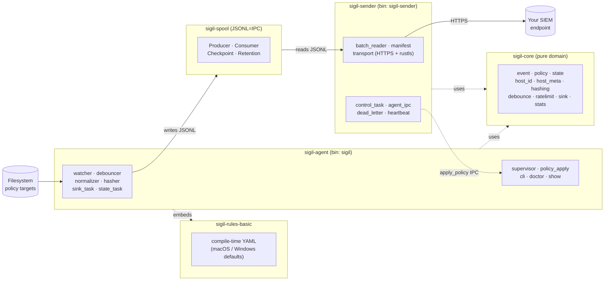

# Sigil

> Sigil writes a line for every change on your machine.


A small Rust agent that watches sensitive files on macOS and Windows and emits
structured, hash-anchored JSONL events for your SIEM. Built with the AI-coding-agent
era in mind: the things that matter today are MCP configurations, launch agents,
credential directories, and other quiet drops that traditional FIM tooling
doesn't tier as critical.

Each event is one JSON object on its own line:

```json
{
  "schema_version": 1,
  "event_id": "019e0cea-42f1-7ef3-9a6a-1721e98ee2ba",
  "ts": "2026-05-10T07:14:32.512Z",
  "host_id": "a2e1f4c9b8d7",
  "agent_version": "0.1.0",
  "severity": "warn",
  "source": {"kind": "file_system"},
  "subject": {"kind": "path", "value": "/Users/alice/.cursor/mcp.json"},
  "evidence": {
    "kind": "file_change",
    "change_kind": "modified",
    "before_hash": "blake3:a31f1c7e9d8b…",
    "after_hash":  "blake3:0d72f8a4c6e8…",
    "size_after": 2148,
    "evidence_quality": "definitive"
  },
  "target_id": "team-mcp-allowlist"
}
```

## Why Sigil?

- **Tiny, honest, host-only.** Pure user-space. No kernel module, no eBPF, no
  phone-home. A single binary plus a YAML policy file.
- **Hash-anchored events.** Every observation carries blake3 hashes (before /
  after) and an `evidence_quality` marker, so a SIEM can tell a clean
  observation apart from one that was coalesced or delayed.
- **Versioned schema.** `schema_version` is part of the contract; rename = break.
- **AI-aware defaults.** Built-in policies cover the paths AI coding agents
  actually touch on macOS and Windows.

### What it catches

Concrete, AI-era examples — drop these into your policy and the agent will
emit a JSONL line every time something changes:

- An AI coding agent silently adding entries to `~/.cursor/mcp.json` or
  `~/.config/claude/mcp.json`.
- A new `.plist` appearing in `~/Library/LaunchAgents/` (a background daemon
  installed by tooling).
- Modifications to `~/.aws/credentials`, `~/.ssh/`, or your shell startup
  files (`.zshrc`, `.bashrc`, `.profile`).
- Drift on any path you list under `targets:` in your policy YAML.

## Architecture

Sigil is a Rust workspace with five crates, organized as two long-running
processes plus three shared libraries.

**Processes**

- `sigil-agent` — the host daemon (`sigil` binary). Owns the `tokio`
  runtime, the `notify`-based filesystem watcher, the event pipeline, CLI
  commands, and platform glue. Writes JSONL posture events to the local
  spool.
- `sigil-sender` — the uploader (`sigil-sender` binary). Reads JSONL
  batches from the spool, ships them to a SIEM endpoint over HTTPS
  (rustls), and hands signed policy responses back to the agent over IPC.

**Libraries**

- `sigil-core` — pure domain library (event, policy, state, hashing, …).
  No OS, `tokio`, or filesystem-watcher dependencies. Consumed by both
  processes.
- `sigil-spool` — JSONL=IPC primitive (`Producer` / `Consumer` /
  `Checkpoint` / `Retention`) used at the agent → sender hop. Durable,
  crash-recoverable, domain-neutral.
- `sigil-rules-basic` — compile-time-embedded baseline rulesets (macOS
  and Windows defaults). The OSS fallback when no operator policy is
  supplied; extended rule packs ship separately.



## Status

- **0.1.x — alpha.** The event schema and CLI surface can break between minor
  releases until 0.2. `schema_version` in every event lets downstream
  consumers detect this.
- **Platforms.** macOS, Windows, and Linux at runtime. The Linux runtime
  landed as a minimal foundation (Phase 3a) and is exercised in CI; some
  refinements are marked `TODO(community)` in `platform/linux.rs` — see
  [CONTRIBUTING.md](CONTRIBUTING.md).
- **Schema.** Version `1`.

## Roadmap

- **Phase 1 — shipped.** Filesystem watcher, JSONL sink, host metadata, state
  database, debounce / rate-limit, JSONL retention GC.
- **Phase 2 — shipped.** Split-process IPC via the durable spool, signed
  policy envelopes, a sender that ships JSONL over mTLS, an operator signing
  CLI, and an OSS reference server. Transport spec was locked on 2026-05-10.
- **Phase 3a — shipped.** Linux runtime (inotify watcher, `/etc/passwd` user
  enumeration, hardware fingerprint). Minimal foundation; refinements open
  for community contribution.
- **Phase 3b/c — planned.** Additional posture signals, reproducible-build
  attestation.

## Design principles

- **No kernel module, no eBPF.** OS-provided file-event APIs only.
- **`forbid(unsafe_code)`** in the core domain crate.
- **Reproducible release builds.** `lto = "thin"`, `codegen-units = 1`,
  `strip = "symbols"`, `panic = "unwind"`.
- **Host-only telemetry.** The agent never opens an outbound connection on
  its own. Shipping events anywhere is a separate, explicit component.
- **The event schema is a public contract.** Wire-string renames and field
  removals are breaking changes and bump the major version.

## Installation

Install the Rust toolchain listed in `rust-toolchain.toml`, then build the
workspace:

```sh
cargo build --release
```

The agent binary is produced at:

```sh
target/release/sigil
```

For development builds, run:

```sh
cargo build
```

## Usage

Run the agent:

```sh
cargo run -p sigil-agent -- run
```

Inspect the effective configuration:

```sh
cargo run -p sigil-agent -- show config
```

Inspect expanded watch paths:

```sh
cargo run -p sigil-agent -- show paths
```

Run diagnostics without starting the daemon:

```sh
cargo run -p sigil-agent -- doctor
```

Print version information:

```sh
cargo run -p sigil-agent -- version
```

## Configuration

Sigil uses built-in defaults plus an optional YAML policy file.

Example policy:

```yaml
version: 1
host_id_strategy: machine_id

overrides:
  - id: shadow-ai-binaries-macos
    tier: standard

targets:
  - id: team-mcp-allowlist
    description: Example MCP allowlist file
    tier: critical
    platform: any
    paths:
      - "~/.config/example/mcp-allowlist.json"
    recursive: false
    follow_symlinks: false
```

An example policy file is available at `config/policy.example.yaml`.

You can override runtime paths from the command line:

```sh
cargo run -p sigil-agent -- \
  --policy config/policy.example.yaml \
  --state-db ./state.db \
  --events-dir ./events \
  run
```

Default production policy locations are platform-specific. The example policy
can be adapted for `/etc/sigil/policy.yaml` on Unix-like systems or
`%ProgramData%\Sigil\policy.yaml` on Windows.

## Security

For responsible disclosure of vulnerabilities, see [SECURITY.md](SECURITY.md).

## Contributing

Bug reports, policy suggestions, and patches are welcome. See
[CONTRIBUTING.md](CONTRIBUTING.md) before opening a PR.

## License

This project is licensed under the Apache License 2.0.

You may use this software for personal, internal, and commercial purposes,
subject to the terms of the Apache License 2.0.

See [LICENSE](LICENSE) and [NOTICE](NOTICE) for details.

## Disclaimer

This software is provided "as is", without warranties or guarantees of any kind.

The author does not guarantee correctness, availability, reliability, security,
compatibility, or fitness for any particular purpose.

The author is not responsible for any direct, indirect, incidental,
consequential, special, exemplary, or other damages, including but not limited to
outages, data loss, security incidents, business interruption, incorrect
results, compatibility problems, or other problems arising from the use of this
software.

Use this software at your own risk.

## Commercial Support and Future Offerings

Commercial support, hosted services, enterprise features, paid add-ons,
consulting, or professional services may be offered separately in the future.

Some future commercial features, hosted components, enterprise modules, or
binary-only add-ons may be distributed under separate commercial terms.

The open-source version remains available under the Apache License 2.0.
