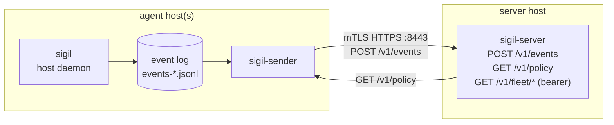

# sigil-server — Install & Operations Guide (Linux)

`sigil-server` is the OSS reference collector. It receives posture events from
agents over **mTLS HTTPS**, persists them as per-host JSONL, serves a **signed
policy bundle** at `GET /v1/policy`, and exposes a bearer-gated read API for
fleet queries. It measures and aggregates; it does not block.

This guide is an end-to-end **production** deployment on Linux. It is distinct
from the lab walkthrough in
[`deployment-2machine-test.html`](deployment-2machine-test.html), which sets up
a throwaway VM for testing. The macOS agent side is covered in
[install-macos-agent.md](install-macos-agent.md).

Validated on **Rocky Linux 9 / RHEL 9** (the maintainer's environment).
Debian/Ubuntu works via the `.deb` package; deltas are called out inline.

---

## 1. Topology & ports



- **Server inbound:** exactly **one** port — `8443/tcp` (the `bind` value). All
  `/v1/*` routes share it.
- **Agent hosts inbound:** none. They only make **outbound** connections to
  `8443`. (egress-only — friendly to locked-down endpoints.)

---

## 2. Install

Pick one. The `.rpm`/`.deb` path is recommended for servers — it ships a
hardened, disabled-by-default systemd unit and a config example.

### Option A — `.rpm` / `.deb` from Releases (RHEL / Rocky / Debian), recommended

Download the package for your distro from the
[latest release](https://github.com/Ju571nK/sigil/releases/latest). These are
**static** builds, so they run on any glibc — including RHEL/Rocky 9:

```sh
# RHEL / Rocky / Fedora
sudo dnf install ./sigil-server-*.x86_64.rpm

# Debian / Ubuntu
sudo apt install ./sigil-server_*_amd64.deb
```

This installs `/usr/bin/sigil-server`, the unit at
`/usr/lib/systemd/system/sigil-server.service`, and
`/etc/sigil/server.yaml.example`.

> Prefer to build the package yourself? `cargo install cargo-deb
> cargo-generate-rpm && packaging/build.sh server` produces them under
> `target/debian/` and `target/generate-rpm/`.

You also need `sigil-sign` (operator CLI) on a trusted workstation to produce
the signed policy bundle — install the `sigil-signer` package or use `install.sh`.

### Option B — `install.sh` (binaries only)

```sh
curl --proto '=https' --tlsv1.2 -fsSL \
  https://raw.githubusercontent.com/Ju571nK/sigil/main/install.sh | sh
```

Installs the six release binaries (`sigil`, `sigil-sender`, `sigil-server`,
`sigil-sign`, `sigil-mcp`, `sigil-hook`) to `~/.local/bin`. You then wire up the
systemd unit and config by hand (sections 4–6).

### Option C — build from source

```sh
cargo build --release -p sigil-server   # → target/release/sigil-server
```

> **aarch64 (ARM) servers:** prebuilt packages are x86_64 only today
> (tracking [#12](https://github.com/Ju571nK/sigil/issues/12)). On ARM, build
> from source. A debug build (`cargo build -p sigil-server`) is fine for staging.

---

## 3. PKI / mTLS

mTLS is **on** only when all three TLS fields are set in `server.yaml`. With any
of them missing the server runs **plain HTTP** (a startup WARN says so) — never
do that off localhost.

You need: a CA, a **server cert** whose SAN matches the address agents will
connect to, and a **client CA** that signs each host's client cert. A single
self-managed CA can play both roles. The recipe below mirrors
[`demo/init.sh`](../demo/init.sh) — the one change that matters in production is
the **`subjectAltName`**.

```sh
cd /etc/sigil   # or wherever you keep PKI material

# 1. CA
openssl req -x509 -newkey rsa:2048 -nodes -days 3650 \
  -keyout ca.key -out ca.crt -subj "/CN=sigil-ca" \
  -addext "basicConstraints=critical,CA:TRUE" \
  -addext "keyUsage=critical,keyCertSign,cRLSign"

# 2. Server cert — SAN MUST contain the exact host/IP agents dial.
cat > server.ext <<'EOF'
basicConstraints = CA:FALSE
keyUsage = critical, digitalSignature, keyEncipherment
extendedKeyUsage = serverAuth
# Use the DNS name agents resolve, OR the literal IP if they dial by address:
subjectAltName = DNS:sigil.example.com
# subjectAltName = IP:192.168.0.50
EOF
openssl req -new -newkey rsa:2048 -nodes -keyout server.key -out server.csr \
  -subj "/CN=sigil.example.com"
openssl x509 -req -in server.csr -CA ca.crt -CAkey ca.key -CAcreateserial \
  -days 825 -extfile server.ext -out server.crt

# 3. Per-host client cert (repeat per agent host).
cat > client.ext <<'EOF'
basicConstraints = CA:FALSE
keyUsage = critical, digitalSignature
extendedKeyUsage = clientAuth
EOF
openssl req -new -newkey rsa:2048 -nodes -keyout client-hostA.key -out client-hostA.csr \
  -subj "/CN=hostA"
openssl x509 -req -in client-hostA.csr -CA ca.crt -CAkey ca.key -CAcreateserial \
  -days 825 -extfile client.ext -out client-hostA.crt

rm -f *.csr *.ext ca.srl
```

Ship `ca.crt` + the host's `client-hostA.{crt,key}` to that agent host (the
sender's `server_ca_path` / `client_cert_path` / `client_key_path`). Keep
`ca.key` offline/secured.

> **SAN is the #1 mTLS gotcha.** If agents dial `https://192.168.0.50:8443` but
> the cert SAN only has a DNS name, the TLS handshake fails. Put the literal
> `IP:` in the SAN, or give agents a resolvable DNS name.

### 3.1 Automated enrollment (B-mint) — optional

Instead of hand-running `openssl` per host (§3 step 3), the server can mint a
host's client cert from a CSR, gated by a single-use, TTL, per-host token. A PMS
(Ansible/Intune) — already enrolled — calls the endpoint on a new host's behalf
and stages the bundle. Enrollment is **off** unless configured, and the server
**refuses to enable it without mTLS** (no cleartext cert minting).

**1. Issue an intermediate CA from your offline root** (the server only ever
holds the intermediate; the root key stays offline):

```sh
openssl req -new -newkey rsa:2048 -nodes -keyout int.key -out int.csr -subj "/CN=sigil-enroll-intermediate"
openssl x509 -req -in int.csr -CA ca.crt -CAkey ca.key -CAcreateserial -days 1825 \
  -extfile <(printf "basicConstraints=critical,CA:TRUE,pathlen:0\nkeyUsage=critical,keyCertSign,cRLSign") -out int.crt
sudo install -m600 int.key /etc/sigil/enroll-int.key
sudo install -m644 int.crt /etc/sigil/enroll-int.crt
```

**2. Configure `server.yaml`** (requires a configured `host_allowlist_path` and
the mTLS triple — both are enforced at boot, else enrollment stays off):

```yaml
enroll_ca_cert_path: "/etc/sigil/enroll-int.crt"
enroll_ca_key_path:  "/etc/sigil/enroll-int.key"   # 0600 or enrollment disables
enroll_tokens_path:  "/var/lib/sigil-server/enroll-tokens.json"
enroll_cert_days: 30                                # short — re-enroll is the revocation story
host_allowlist_path: "/etc/sigil/host-allowlist.json"   # REQUIRED (restrictive set)
```

The server validates the intermediate at boot (CA:TRUE, key⇄cert match, 0600).

**3. Issue a token** (server host; prints the plaintext once — only its hash is
stored):

```sh
sigil-server enroll-token --config /etc/sigil/server.yaml --host-id <agent-host_id> --ttl 1h
#  → enrollment token: <opaque> (give this to the PMS for that host)
```

**4. Enroll** (the PMS generates the host keypair + CSR with `CN=<host_id>` and
calls the endpoint over mTLS):

```sh
openssl req -new -newkey rsa:2048 -nodes -keyout host.key -out host.csr -subj "/CN=<host_id>"
curl --cert pms.crt --key pms.key --cacert ca.crt \
  -X POST https://sigil.example.com:8443/v1/enroll \
  -H 'content-type: application/json' \
  -d "{\"token\":\"<opaque>\",\"host_id\":\"<host_id>\",\"csr_pem\":\"$(awk '{printf "%s\\n",$0}' host.csr)\"}"
#  → {"client_cert_pem":"...", "ca_chain_pem":"...", "host_id":"...", "not_after":"...", "serial":"..."}
```

The server signs with a **fixed client-cert profile** (`CA:FALSE`, `clientAuth`,
`subjectAltName=DNS:<host_id>`), re-inspects the issued cert, adds the host to
the allowlist, and writes a signed line to `enrollment-audit.jsonl`. The host
installs `client_cert_pem` + its own `host.key` + `ca_chain_pem` as the sender's
mTLS material (§7). Tokens are single-use; a failed mint spends the token (issue
a fresh one). Every token failure returns a generic `403 enrollment_denied`.

> Enrollment **mints** certs (Part B). Read-only **artifact** serving (Part A,
> §5.1) is separate. Per-host cert↔host_id binding, CRL/OCSP revocation, and
> on-host keygen attestation are follow-ups; short cert lifetimes are the MVP's
> revocation substitute.

---

## 4. Signed policy bundle

The server serves a **signed** policy at `/v1/policy`; agents verify the
signature against their keystore before applying. Produce it with `sigil-sign`
on a trusted workstation (never on the server with the live key):

```sh
sigil-sign keygen --id prod-key-1 --out signing-key.json     # ed25519 keypair
sigil-sign sign \
  --in policy.yaml \
  --key signing-key.json \
  --policy-version 2 \
  --valid-until 2027-01-01T00:00:00Z \
  --out signed-policy.json
```

Copy `signed-policy.json` to the server's `policy_bundle_path` (section 5). The
**public** half goes into each agent's keystore — see
[install-macos-agent.md § keystore](install-macos-agent.md). Keep `signing-key.json` offline.

> `--policy-version` must be **greater than** the `version:` already applied by
> agents, or boot reconciliation rejects it as a regression. Start at `2`.

---

## 5. Configure `server.yaml`

Copy the example and edit. Full field reference:

```yaml
# /etc/sigil/server.yaml
bind: "0.0.0.0:8443"                                   # all interfaces; 127.0.0.1 if behind a proxy
events_out_dir: "/var/lib/sigil-server/events"         # per-host date-rotated JSONL
policy_bundle_path: "/var/lib/sigil-server/signed-policy.json"

# mTLS — all three or none:
tls_cert_path: "/etc/sigil/server.crt"
tls_key_path:  "/etc/sigil/server.key"
client_ca_path: "/etc/sigil/ca.crt"

# Optional hardening:
# host_allowlist_path: "/etc/sigil/host-allowlist.json"  # {"hosts":["uuid",...]}
# high_water_path: "/var/lib/sigil-server/high_water.json" # at-least-once dedup

# Optional — serve signed agent artifacts for air-gapped / PMS install (§5.1):
# artifacts_dir: "/var/lib/sigil-server/artifacts"
```

### Read API token

The fleet/read endpoints (`/v1/meta`, `/v1/fleet/*`, `/v1/events`, …) are gated
by a bearer token from the **`SIGIL_SERVER_READ_TOKEN`** environment variable.
If it is unset, those routes return **404** (the data plane and `/v1/healthz`
still work). Set it via a systemd drop-in so it isn't in the world-readable
config:

```sh
sudo systemctl edit sigil-server
# [Service]
# Environment=SIGIL_SERVER_READ_TOKEN=<long-random-token>
```

### 5.1 Serve agent artifacts (air-gapped / PMS install)

Set `artifacts_dir` and the server serves the signed release files read-only, so
an air-gapped fleet or a PMS (Ansible/Intune) can pull binaries from the server
it already runs instead of GitHub. Absent ⇒ the routes 404 (feature off).

Populate the directory from a release (the operator does this once per version):

```sh
sudo mkdir -p /var/lib/sigil-server/artifacts
# copy the GitHub release assets you intend to serve, e.g.:
#   sigil-<ver>-<target>.tar.gz / .zip, sigil*_<ver>*.deb / .rpm,
#   SHA256SUMS, build-manifest.json
```

Two routes, both gated by the **read token** (`SIGIL_SERVER_READ_TOKEN`) like the
rest of the read API:

```sh
curl -H "Authorization: Bearer $TOKEN" https://sigil.example:8443/v1/artifacts
#   → {"artifacts":["SHA256SUMS","build-manifest.json","sigil-…-musl.tar.gz", …]}
curl -H "Authorization: Bearer $TOKEN" \
  https://sigil.example:8443/v1/artifacts/sigil-0.6.2-aarch64-unknown-linux-musl.tar.gz -O
```

The one-line installer can target the server directly — it verifies the same
`SHA256SUMS`, so the trust story is unchanged:

```sh
SIGIL_VERSION=v0.6.2 \
SIGIL_BASE_URL=https://sigil.example:8443/v1/artifacts \
SIGIL_BASE_TOKEN=$TOKEN \
  sh -c "$(curl -fsSL https://raw.githubusercontent.com/Ju571nK/sigil/main/install.sh)"
```

> The artifact files stay **operator-populated and signed**; the server only
> serves them read-only. Filenames are whitelisted (no path traversal). Per-host
> certificate enrollment is a separate concern (not this endpoint).

---

## 6. Firewall & SELinux (Rocky / RHEL)

```sh
sudo firewall-cmd --add-port=8443/tcp --permanent && sudo firewall-cmd --reload
```

Ubuntu: `sudo ufw allow 8443/tcp`.

SELinux is **Enforcing** on Rocky/RHEL by default. The package's
`StateDirectory`/`LogsDirectory` (`/var/lib/sigil-server`, `/var/log/sigil-server`)
get correct contexts automatically. If you point `events_out_dir` somewhere
custom, label it: `sudo semanage fcontext -a -t var_lib_t "/your/path(/.*)?" &&
sudo restorecon -Rv /your/path`.

---

## 7. Run

```sh
# Package install:
sudo cp /etc/sigil/server.yaml.example /etc/sigil/server.yaml
sudo $EDITOR /etc/sigil/server.yaml
sudo systemctl enable --now sigil-server
journalctl -u sigil-server -f          # watch startup; confirm "mTLS" not "plain HTTP"

# Manual (source/install.sh):
SIGIL_SERVER_READ_TOKEN=<token> sigil-server serve --config /etc/sigil/server.yaml
```

The unit runs as `root` with `ProtectSystem=strict` and writes only to its
state/log dirs. See [`packaging/README.md`](../packaging/README.md) for the unit
details.

---

## 8. Verify

```sh
# mTLS reachability (no token needed for healthz):
curl --cacert ca.crt --cert client-hostA.crt --key client-hostA.key \
  https://sigil.example.com:8443/v1/healthz                       # {"status":"ok"}

# Read API (token required):
curl -H "Authorization: Bearer <token>" \
  --cacert ca.crt --cert client-hostA.crt --key client-hostA.key \
  https://sigil.example.com:8443/v1/fleet/hosts

# Without the bearer token → 401 (proves the gate works):
curl --cacert ca.crt --cert client-hostA.crt --key client-hostA.key \
  https://sigil.example.com:8443/v1/fleet/hosts                   # 401
```

Once an agent+sender are pointed here, events land under
`<events_out_dir>/<host_id>/…jsonl` and the host appears in `/v1/fleet/hosts`.

---

## 9. Connect agents

For each agent host: issue a client cert (section 3), then configure that host's
**sender** ([install-macos-agent.md § ship to a server](install-macos-agent.md)).
Two alignment rules from the field:

1. **`host_id` must match.** The sender's `host_id` (or `SIGIL_HOST_ID`) must
   equal that host's agent `host_id` (the UUID in the agent's `state.db`). A
   mismatch makes the server reject the **whole batch** with
   `host_id_payload_mismatch`. Find the agent's id in its startup log:
   `journalctl -u sigil | grep "agent host_id resolved"`.
2. **One client cert per host**, all signed by `client_ca_path`.

---

## 10. Operations & troubleshooting

Operational notes (paths, signals, log levels): [runbook/operations.md](runbook/operations.md).
SIEM rules: [runbook/siem-rules.md](runbook/siem-rules.md).

| Symptom | Cause | Fix |
|---|---|---|
| Startup logs "plain HTTP" / no mTLS | One of the 3 `tls_*` fields unset | Set all three |
| TLS handshake fails from agent | Server cert SAN ≠ dialed host/IP | Put `DNS:`/`IP:` in SAN (§3) |
| Server rejects all events, `host_id_payload_mismatch` | sender `host_id` ≠ agent `host_id` | Align them (§9) |
| Read endpoints return 404 | `SIGIL_SERVER_READ_TOKEN` unset | Set it (§5) |
| Read endpoints return 401 | Missing/wrong bearer token | Send `Authorization: Bearer <token>` |
| `No route to host` from agent | Firewall / port not open | Open `8443/tcp` (§6) |

---

*Server defaults, ports, and the mTLS field semantics in this guide are taken
from `config/server.example.yaml` and `packaging/systemd/sigil-server.service`.*
