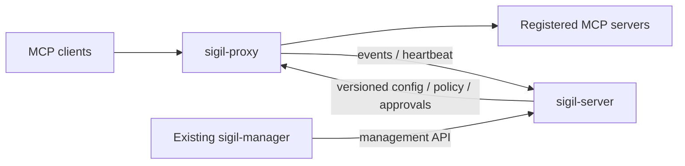

# Sigil Proxy 설계·계약 초안

2026-09-27 · 제품 경계는 확정, 아래 신규 타입·API·설정 이름은 제안이다.
실제 코드 계약은 P0에서 기존 server/manager와 대조해 고정한다.

## 배치

- `crates/sigil-proxy`: 별도 프로세스·배포 단위. proxy가 내려가면 중계 연결은 끊긴다.
- `sigil-core`: proxy DTO/정책/이벤트 계약. 기존 host 이벤트에 proxy를 가짜 host로 넣지 않는다.
- `sigil-server`: 등록·배포·저장·조회·RBAC·승인. 새 쓰기 API는 기존 read 토큰으로 허용하지 않는다.
- `sigil-manager`: 기존 앱에 화면 추가. 에이전트에게 관리 자격증명을 전달하지 않는다.
- `sigil-mcp`: 기존 조회·assess 역할 유지. proxy 관리나 승인 쓰기 도구를 자동 추가하지 않는다.
- server 단절 중에도 마지막 유효 설정으로 중계하며 로컬 spool에 기록한다.
  P1 신규 등록/설정 변경에는 server가 필요하다. 완전한 standalone 관리 모드는 P1 범위 밖이다.

## 데이터 경계와 프로토콜

P1은 한 등록 라우트가 한 upstream을 가리킨다. 여러 서버의 도구를 하나의 가상
서버로 합치는 기능과 프로토콜 버전 변환은 제외한다.

관찰을 위해 JSON-RPC를 파싱하지만 알 수 없는 필드를 임의 삭제하지 않는다.
지원 버전과 메시지 방향은 adapter별로 명시한다. 구버전의 session/initialize,
서버 요청과 신버전의 요청별 metadata를 하나의 상태 기계로 가정하지 않는다.
`rmcp` 버전·feature·Rust MSRV 적합성은 P0에서 확인한다.

upstream 도구 목록은 페이지 완료 후에만 baseline을 갱신한다. 목록은 서버뿐 아니라
권한/credential scope와 프로토콜 버전별로 분리한다. 한 사용자의 목록을 다른
사용자에게 노출하지 않는다. 불완전 스냅샷은 상태를 남기고 삭제 판단을 하지 않는다.
기존 파일 캐시 baseline과 실시간 proxy 관찰은 서로 다른 evidence source다.

## 제안 데이터 계약

| 타입 | 주요 필드·불변식 |
|---|---|
| ProxyRegistration | proxy_id, display_name, identity_ref, desired_config_version, applied_config_version, last_seen |
| UpstreamRegistration | upstream_id, endpoint, supported_protocols, credential_ref, destination_policy, enabled |
| ActorContext | actor_id, actor_kind(human/non_human/unknown), authentication_method, evidence_source, credential_owner_id?, delegation_id? |
| Invocation | invocation_id, proxy_id, upstream_id, protocol_version, method, tool_name?, actor, policy_version?, metadata_baseline_id?, started_at |
| Decision | invocation_id, mode, evaluated_action, applied_action, reason_codes, approval_id? |
| Completion | invocation_id, transport_status, tool_status?, delivery_state, duration_ms, response_bytes, finished_at |
| AuditEnvelope | schema_version, event_id, proxy_id, sequence, occurred_at, received_at, event_type, payload |
| Delegation(P2) | delegation_id, actor_id, credential_owner_id, allowed_targets, expires_at, revoked_at? |
| Approval(P3) | approval_id, invocation_fingerprint, approver_id, state, expires_at, consumed_at? |

- upstream 요청 ID는 proxy의 전역 호출 ID와 별개다. 원문 session ID는 기본 감사 기록에서 제외한다.
- event_id는 재전송에도 유지하며 중앙 저장에서 유일성으로 중복 제거한다.
- 완료 이벤트가 없어도 시작 기록을 조회할 수 있다. 재시작 시 미완료 요청을 성공으로 복원하지 않는다.
- 결과 불명은 실패/미실행과 다르다. 취소 요청 수신도 upstream 실행 중단 증거가 아니다.
- 오류 메시지·URL query·헤더·도구 설명도 민감한 원문으로 취급한다.
- 도구 설명/스키마는 크기 제한과 접근 통제를 적용한 별도 metadata 저장소에 보관한다.
  UI는 비신뢰 텍스트로 렌더링하고 HTML/Markdown 실행이나 자동 링크 접근을 하지 않는다.
- 일반 인자 해시는 저엔트로피 비밀 추측을 허용하므로 기본 감사 데이터로 수집하지 않는다.
  승인 fingerprint는 정규화 방식과 보호된 HMAC 키를 별도로 정의한다.

## 제안 API 경계

다음은 URI 예약이나 구현 완료 선언이 아니다. P0에서 OpenAPI/JSON Schema와 오류 계약으로 고정한다.

| 면 | 예시 | 권한 |
|---|---|---|
| Proxy 데이터 | `/mcp/{upstream_id}` | 인증된 client와 route grant |
| Proxy 운영 | `/healthz`, `/readyz`, metrics | 별도 운영 접근, 세부 정보 제한 |
| Server 관리 | `/v1/proxies`, `/v1/proxies/{id}/upstreams` | 조회자/운영자 분리 |
| Server 조회 | `/v1/proxy-invocations`, `/v1/proxy-invocations/{id}` | scope별 조회 권한 |
| Server 수집 | `/v1/proxy-events`, heartbeat/config 동기화 | 등록 proxy identity |
| Server 승인(P3) | `/v1/proxy-approvals/{id}/decision` | 별도 승인자 권한 |

조회는 cursor pagination, 최대 page size, 시간·proxy·upstream·actor·결과 필터를 갖는다.
설정 변경은 expected_version 조건과 충돌 응답을 사용한다. 읽기 권한이 관리 쓰기를
뜻하지 않는다. proxy는 인증서/토큰과 연결된 자신의 ID로만 수집·설정 조회를 수행한다.
설정·승인 변경 감사는 MCP 호출 감사와 구분한다.

## 설정과 비밀

제안 필드: proxy_id, listen, control_plane, identity_ref, state_dir,
limits, audit_retention, destination_policy. 모드는 기본 observe다.

- 로컬 bootstrap 설정은 ID·리스너·중앙 주소·신뢰 루트·비밀 참조만 가진다.
- upstream/route/policy는 중앙 버전 설정을 원자적으로 적용한다. 로컬 값과 묵시적으로 병합하지 않는다.
- 잘못된 업데이트는 기존 유효 버전을 유지하고 desired/applied 차이를 보고한다.
- 비밀은 파일/OS secret store 참조로 주입한다. 중앙 UI는 참조·회전 상태만 다룬다.
- P0에서 OS별 기본 경로, CLI/env/file 우선순위, 파일 권한, hot reload 가능 필드를 고정한다.
- 인증은 P1부터 필요하다. 관리형 client 인증의 실제 방식은 지원 client 기능 확인 후 결정한다.
  사용자별 upstream OAuth 위임은 P3이고, P1은 제한된 서비스 credential 연결부터 검증한다.

## 장애 동작

| 상황 | Observe(P1) | Enforce(P2 이후) |
|---|---|---|
| 중앙 연결 단절 | 마지막 유효 route/auth 설정과 spool로 지속; degraded 표시 | 유효 정책·위임 기간 안에서만 지속; 새 승인 불가 |
| 정책 만료/평가 불가 | unknown 판단을 기록; route/auth 검사는 유지 | 해당 호출 미전달 |
| route/auth 설정 만료 | 해당 route 미전달 | 해당 route 미전달 |
| spool 한도 도달 | 기본은 새 호출 중단; 명시적 allow-with-gap 옵션만 관찰 모드에 허용 | 새 호출 중단 |
| malformed/초과 요청 | 미전달, 제한된 오류 기록 | 동일 |
| upstream 응답 유실 | 결과 불명, 자동 재실행 없음 | 동일 |
| 재시작 | 미완료 기록 복구, 메모리 세션 복구 보장 없음 | 소비된 승인을 되살리지 않음 |

allow-with-gap은 누락 구간/카운터를 별도 예약 공간에 남긴다. 그것도 실패하면
health/metrics에 감사 불가를 표시하며 완전한 감사 기록을 주장하지 않는다.
스트리밍 한도 초과나 시간 초과로 연결을 닫아도 이미 일어난 upstream 부작용은 되돌릴 수 없다.

## 신뢰 경계와 승인

proxy가 upstream 자격증명을 독점하고 직접 연결도 제한된 배포에서만 해당 경로의
강제 통제를 주장한다. 사용자와 에이전트가 같은 OS 계정/브라우저 세션을 공유하면
인간 승인 독립성을 자동 보장하지 않는다. P3에서 승인자 인증과 필요한 step-up을 결정한다.

승인 상태: pending → approved / denied / expired / cancelled,
approved → consumed / expired / invalidated. 전이는 원자적이며 모두 감사한다.
승인 소비와 upstream 전송 사이 장애는 재실행하지 않고 결과 불명으로 처리한다.
네트워크 경계에서 exactly-once 실행을 보장한다고 주장하지 않는다.
승인 후 정책·위임·도구 정의 변경은 재검증하며 일치하지 않으면 새 승인이 필요하다.

## 열린 결정과 해결 시점

| ID | 결정 | 담당 단계/필요 증거 |
|---|---|---|
| D-01 | P1 protocol version·capability 범위와 SDK | P0; 공식 명세 + fixture + 실제 client probe |
| D-02 | client 인증, bootstrap 경로/우선순위, control-plane identity | P0; server/manager 기존 인증 조사와 client 기능 검증 |
| D-03 | event 저장/index 및 API/schema 호환성 | P0; 기존 consumer의 unknown variant 처리와 보관 용량 검증 |
| D-04 | 수치 limits·성능 목표·첫 배포 OS | P0; 환경을 고정한 streaming/load 측정 계획 |
| D-05 | tool metadata baseline 공유 방식 | P0; 기존 baseline의 HOME binding과 proxy identity 차이 확인 |
| D-06 | 승인 대기 또는 승인 후 재요청, 에러 표현 | P3 착수 전; client timeout·재시도·재개 실측 |
| D-07 | 사용자 OAuth와 승인자 step-up 신뢰 모델 | P3 착수 전; token audience·권한 분리 검증 |

D-01–05 확정이 production 경로 구현의 시작 조건이다. 문서·fixture·probe 작업은 바로 진행 가능하다.
